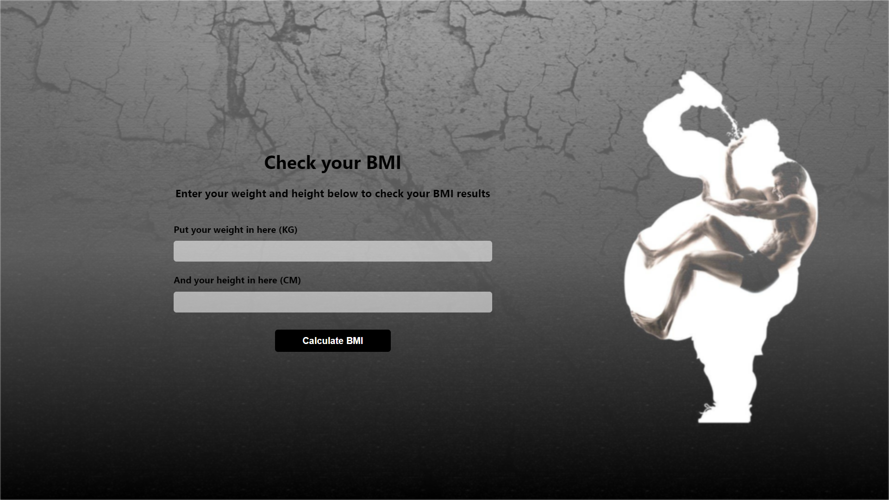
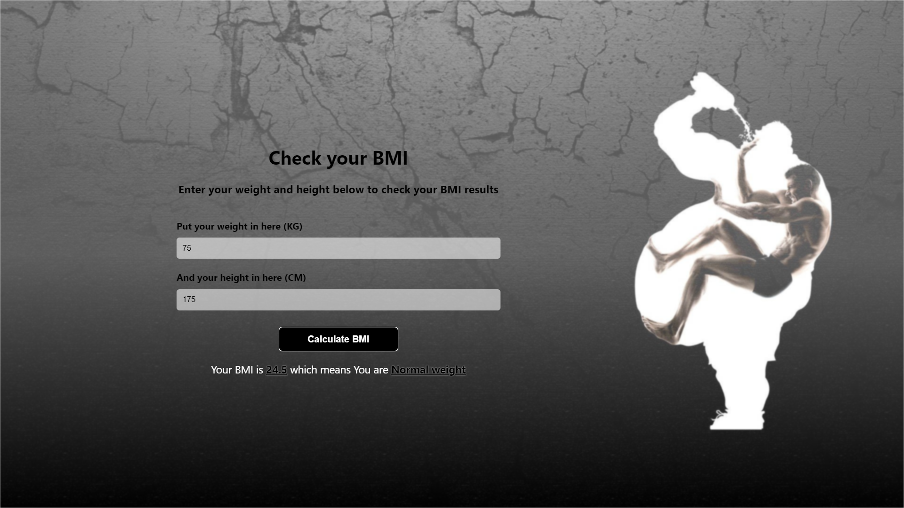

# Tugas Skilvul #Tech4Impact Kampus Merdeka Cycle 4: Front-End Web Development

## Technical Project Assignment (TPA) #2 - BMI Calculator
> Membuat sebuah aplikasi Kalkulator BMI (Body Mass Index) menggunakan HTML, CSS, dan Javascript sesuai dengan Expected Result, kemudian menguploadnya ke dalam repository, dan mendeploy ke dalam hosting (Netlify atau vercel).
---

## Specs
1. Buatlah aplikasi website untuk menghitung Body Mass Index (BMI) berdasarkan standar yang telah ditetapkan.
2. User harus memasukkan data **Berat Badan** dalam **KG**
3. User harus memasukkan data **Tinggi Badan** dalam **CM**
4. Rumus BMI untuk satuan **KG** dan **CM** adalah `Berat Badan/(Tinggi Badan/100)^2`
5. Aplikasi harus menampilkan status BMI sesuai dengan standar berikut:

- BMI Categories:
  - Underweight = <18.5
  - Normal weight = 18.5 – 24.9
  - Overweight = 25 – 29.9
  - Obesity = BMI of 30 or greater
  
⠀
## Expected Result

- Berat Badan 60 KG
- Tinggi Badan 167 CM
  BMI = 60 / (167/100)^2
  BMI = 60 / (2.8)
  BMI = 21.5
  BMI Categories: Normal Weight

---

## Bahasa Pemrograman
- HTML
- CSS
- Javascript

---

## Sites Link
[BMI Calculator](https://)

---

## Preview
1. Before Calculate

2. After Calculate
